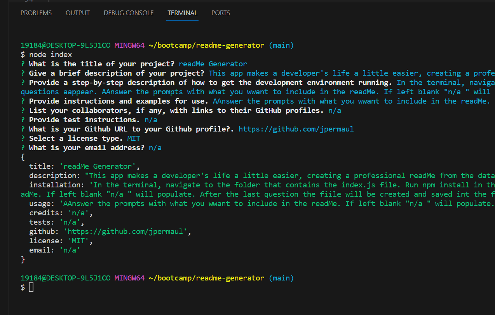

# ReadMe Generator 

  
  
  ## Description
  
  This app makes the life of a developer a little easier by creating a readMe file based on the user input.
  
  ## Table of Contents 
  
  
  
  - [Installation](#installation)
  - [Usage](#usage)
  - [Credits](#credits)
  - [License](#license)
  - [Questions](#questions)
  - [Tests](#tests)
  
  ## Installation
  
  First, open your command line and navigate to the folder containing the index.js file. Then run npm install. Then you can run the app by typing node index.js in the command line.
  
  ## Usage
  
  Follow the prompts. Once the final question has been answered a readME.md will be generated and saved to the folder.

  Here is a linke to an instructional video: https://watch.screencastify.com/v/0GTJnv7OsClQskVWCd1w

  
  
  
  
  
  ## Credits
  
  n/a
  
  ## License
  
  This application is covered under the MIT license.
  
  ## Questions

  For additional questions you can reach me at the following:
  github.com/jpermaul
  jnpermaul@gmail.com

  ## Tests

  n/a
  
  
  
  

